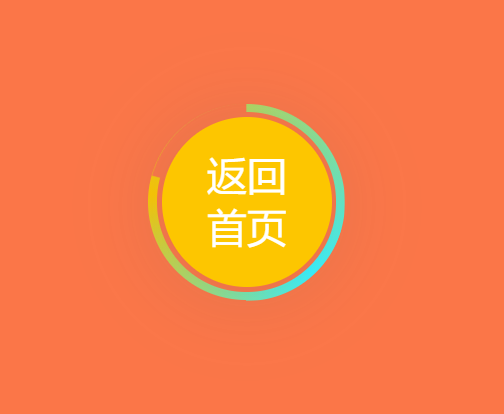
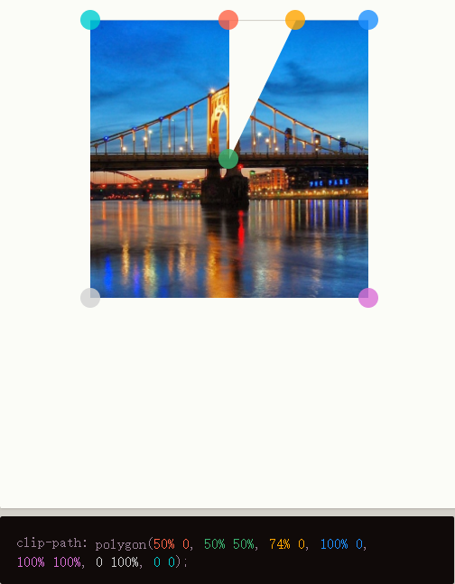
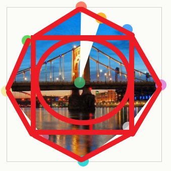

## 业务需求
实现红包中返回首页按钮, 并伴随环状渐变色的进度条  

  
思考: 
1. 使用两块挡板用裁剪动画实现
 - pass, 原因: 由上至下变化形状速度不均匀, 并非真正的环状进度条
2. 使用两块挡板叠加旋转露出底部渐变色, 右侧旋转到一半时返回原位并变成底部渐变色,另一块挡板旋转进入该图层下,露出剩余颜色, 实现均匀变化效果  
(缺点: 渐变色重叠会有露出且动画变换会产生闪烁)  
3. 利用clip-path画出有缺口的挡板, 将挡板缺口均匀扩展 (9.8更新)  
https://bennettfeely.com/clippy/  
该网站是一个CSS clip-path maker  


## 优化方法三中挡板速度不均匀问题(2021/9/9)
  
由于之前挡板使用圆的外切正方形导致挡板衰变消失速度不一造成一快一慢卡顿  
于是进一步优化图形成8边型且顶点离圆心距离相等

```html
<!DOCTYPE html>
<html lang="en">

<head>
    <meta charset="UTF-8">
    <meta http-equiv="X-UA-Compatible" content="IE=edge">
    <meta name="viewport" content="width=device-width, initial-scale=1.0">
    <title>Document</title>
</head>
<style>
    .bg {
        position: relative;
        width: 1080px;
        height: 1700px;
        background: #fb7648;
        box-shadow: 0px 0px 120px rgba(0, 2, 4, 0.2);
        display: flex;
        justify-content: center;
        align-items: center;
    }

    .back-button {
        background: #fdc600;
        box-shadow: 0px 5.10638px 102.128px rgba(102, 102, 102, 0.2);
        width: 204.26px;
        height: 204.26px;
        border-radius: 50%;
        position: absolute;
        z-index: 999;
    }

    .back-text {
        position: absolute;
        left: 50%;
        top: 50%;
        transform: translate(-50%, -50%);
        font-weight: 500;
        font-size: 48px;
        color: #ffffff;
        width: 96px;
        height: 130px;
    }

    .cicle-gap {
        width: 215px;
        height: 215px;
        border-radius: 50%;
        position: absolute;
        background: #fb7648;
        z-index: 99;
    }

    .cicle-bg {
        width: 236px;
        height: 236px;
        border-radius: 50%;
        position: absolute;
        background: conic-gradient(from 164.26deg at 50% 50.89%,
                #37f3ff -27.8deg,
                #fdc600 111.78deg,
                #37f3ff 332.2deg,
                #fdc600 471.78deg);
    }

    .cicle-baffle {
        width: 334px;
        height: 334px;
        position: absolute;
        background: #fb7648;
        animation: loading-baffle 10s linear 0s infinite;
    }

    @keyframes loading-baffle {
        0% {
            clip-path: polygon(50% 0, 50% 50%, 50% 0, 85% 14.7%, 100% 50%, 85% 85.3%, 50% 100%, 15% 85.3%, 0 50%, 15% 14.7%);
        }

        12.5% {
            clip-path: polygon(50% 0, 50% 50%, 85% 14.7%, 85% 14.7%, 100% 50%, 85% 85.3%, 50% 100%, 15% 85.3%, 0 50%, 15% 14.7%);
        }

        25% {
            clip-path: polygon(50% 0, 50% 50%, 100% 50%, 100% 50%, 100% 50%, 85% 85.3%, 50% 100%, 15% 85.3%, 0 50%, 15% 14.7%);
        }

        37.5% {
            clip-path: polygon(50% 0, 50% 50%, 85% 85.3%, 85% 85.3%, 85% 85.3%, 85% 85.3%, 50% 100%, 15% 85.3%, 0 50%, 15% 14.7%);
        }

        50% {
            clip-path: polygon(50% 0, 50% 50%, 50% 100%, 50% 100%, 50% 100%, 50% 100%, 50% 100%, 15% 85.3%, 0 50%, 15% 14.7%);
        }

        62.5% {
            clip-path: polygon(50% 0, 50% 50%, 15% 85.3%, 15% 85.3%, 15% 85.3%, 15% 85.3%, 15% 85.3%, 15% 85.3%, 0 50%, 15% 14.7%);
        }

        75% {
            clip-path: polygon(50% 0, 50% 50%, 0 50%, 0 50%, 0 50%, 0 50%, 0 50%, 0 50%, 0 50%, 15% 14.7%);
        }

        87.5% {
            clip-path: polygon(50% 0, 50% 50%, 15% 14.7%, 15% 14.7%, 15% 14.7%, 15% 14.7%, 15% 14.7%, 15% 14.7%, 15% 14.7%, 15% 14.7%);
        }

        100% {
            clip-path: polygon(50% 0, 50% 50%, 50% 0, 50% 0, 50% 0, 50% 0, 50% 0, 50% 0, 50% 0, 50% 0);
        }
    }
</style>

<body>
    <div class="bg">
        <div class="back-button">
            <div class="back-text">返回 首页</div>
        </div>
        <div class="cicle-gap"></div>
        <div class="cicle-bg"></div>
        <div class="cicle-baffle"></div>
    </div>
</body>

</html>
```

## 方法三实现
```html
<!DOCTYPE html>
<html lang="en">

<head>
    <meta charset="UTF-8">
    <meta http-equiv="X-UA-Compatible" content="IE=edge">
    <meta name="viewport" content="width=device-width, initial-scale=1.0">
    <title>Document</title>
</head>
<style>
    .bg {
        position: relative;
        width: 1080px;
        height: 1700px;
        background: #fb7648;
        box-shadow: 0px 0px 120px rgba(0, 2, 4, 0.2);
        display: flex;
        justify-content: center;
        align-items: center;
    }

    .back-button {
        background: #fdc600;
        box-shadow: 0px 5.10638px 102.128px rgba(102, 102, 102, 0.2);
        width: 204.26px;
        height: 204.26px;
        border-radius: 50%;
        position: absolute;
        z-index: 999;
    }

    .back-text {
        position: absolute;
        left: 50%;
        top: 50%;
        transform: translate(-50%, -50%);
        font-weight: 500;
        font-size: 48px;
        color: #ffffff;
        width: 96px;
        height: 130px;
    }

    .cicle-gap {
        width: 215px;
        height: 215px;
        border-radius: 50%;
        position: absolute;
        background: #fb7648;
        z-index: 99;
    }

    .cicle-bg {
        width: 236px;
        height: 236px;
        border-radius: 50%;
        position: absolute;
        background: conic-gradient(from 164.26deg at 50% 50.89%,
                #37f3ff -27.8deg,
                #fdc600 111.78deg,
                #37f3ff 332.2deg,
                #fdc600 471.78deg);
    }

    .cicle-baffle {
        width: 236px;
        height: 236px;
        position: absolute;
        background: #fb7648;
        animation: loading-baffle 4s linear 0s infinite;
    }

    @keyframes loading-baffle {
        0% {
            clip-path: polygon(50% 0, 50% 50%, 50% 0, 100% 0, 100% 100%, 0 100%, 0 0);
        }

        12.5% {
            clip-path: polygon(50% 0, 50% 50%, 100% 0, 100% 0, 100% 100%, 0 100%, 0 0);
        }

        25% {
            clip-path: polygon(50% 0, 50% 50%, 100% 50%, 100% 50%, 100% 100%, 0 100%, 0 0);
        }

        37.5% {
            clip-path: polygon(50% 0,
                    50% 50%,
                    100% 100%,
                    100% 100%,
                    100% 100%,
                    0 100%,
                    0 0);
        }

        50% {
            clip-path: polygon(50% 0,
                    50% 50%,
                    50% 100%,
                    50% 100%,
                    50% 100%,
                    0 100%,
                    0 0);
        }

        62.5% {
            clip-path: polygon(50% 0, 50% 50%, 0 100%, 0 100%, 0 100%, 0 100%, 0 0);
        }

        75% {
            clip-path: polygon(50% 0, 50% 50%, 0 50%, 0 50%, 0 50%, 0 50%, 0 0);
        }

        87.5% {
            clip-path: polygon(50% 0, 50% 50%, 0 0, 0 0, 0 0, 0 0, 0 0);
        }

        100% {
            clip-path: polygon(50% 0, 50% 50%, 50% 0, 50% 0, 50% 0, 50% 0, 50% 0);
        }
    }
</style>

<body>
    <div class="bg">
        <div class="back-button">
            <div class="back-text">返回 首页</div>
        </div>
        <div class="cicle-gap"></div>
        <div class="cicle-bg"></div>
        <div class="cicle-baffle"></div>
    </div>
</body>

</html>
```

## 方法二实现
```vue
<template>
  <div class="bg">
    <div class="back-button">
      <div class="back-text">返回 首页</div>
    </div>
    <div class="cicle-gap" />
    <div class="cicle-bg"></div>
    <div class="cicle-left"></div>
    <div class="cicle-right"></div>
  </div>
</template>

<script setup>
</script>

<style>
.bg {
  position: relative;
  width: 1080px;
  height: 1700px;
  background: #fb7648;
  box-shadow: 0px 0px 120px rgba(0, 2, 4, 0.2);
  display: flex;
  justify-content: center;
  align-items: center;
}

.back-button {
  background: #fdc600;
  box-shadow: 0px 5.10638px 102.128px rgba(102, 102, 102, 0.2);
  width: 204.26px;
  height: 204.26px;
  border-radius: 50%;
  position: absolute;
  z-index: 999;
}

.back-text {
  position: absolute;
  left: 50%;
  top: 50%;
  transform: translate(-50%, -50%);
  font-weight: 500;
  font-size: 48px;
  color: #ffffff;
  width: 96px;
  height: 130px;
}

.cicle-gap {
  width: 215px;
  height: 215px;
  border-radius: 50%;
  position: absolute;
  background: #fb7648;
  z-index: 99;
}

.cicle-bg {
  width: 236px;
  height: 236px;
  border-radius: 50%;
  position: absolute;
  background: conic-gradient(
    from 164.26deg at 50% 50.89%,
    #37f3ff -27.8deg,
    #fdc600 111.78deg,
    #37f3ff 332.2deg,
    #fdc600 471.78deg
  );
}

.cicle-left {
  width: 238px;
  height: 238px;
  border-radius: 50%;
  clip-path: polygon(0 0, 50% 0, 50% 100%, 0 100%);
  position: absolute;
  background: #fb7648;
  animation: loading-left 4s linear 0s infinite;
}

.cicle-right {
  width: 236px;
  height: 236px;
  border-radius: 50%;
  clip-path: polygon(50% 0, 100% 0, 100% 100%, 50% 100%);
  position: absolute;
  background: #fb7648;
  animation: loading-right 4s linear 0s infinite;
}

@keyframes loading-left {
  50% {
    transform: rotate(0deg);
  }

  100% {
    transform: rotate(180deg);
  }
}
@keyframes loading-right {
  0% {
    background: #fb7648;
  }
  50% {
    background: #fb7648;
    transform: rotate(180deg);
  }
  50.1% {
    transform: rotate(0deg);
    background: conic-gradient(
      from 164.26deg at 50% 50.89%,
      #37f3ff -27.8deg,
      #fdc600 111.78deg,
      #37f3ff 332.2deg,
      #fdc600 471.78deg
    );
  }
  100% {
    transform: rotate(0deg);
    background: conic-gradient(
      from 164.26deg at 50% 50.89%,
      #37f3ff -27.8deg,
      #fdc600 111.78deg,
      #37f3ff 332.2deg,
      #fdc600 471.78deg
    );
  }
}
</style>
```

## 后记
应该进一步学习svg或canvas制作