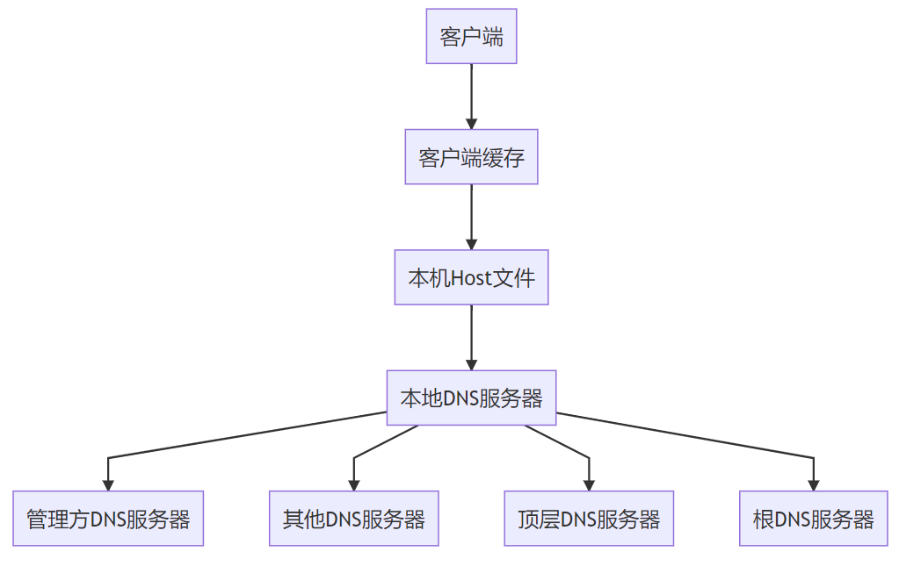
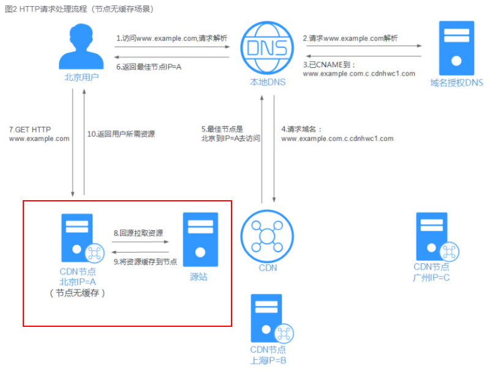
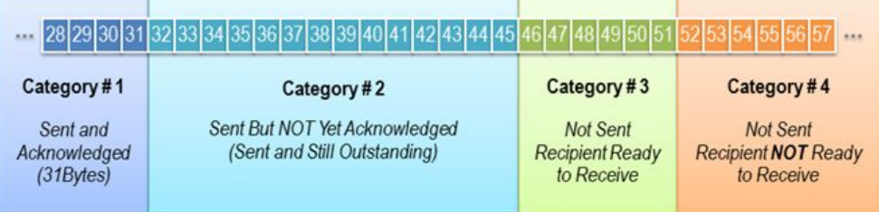
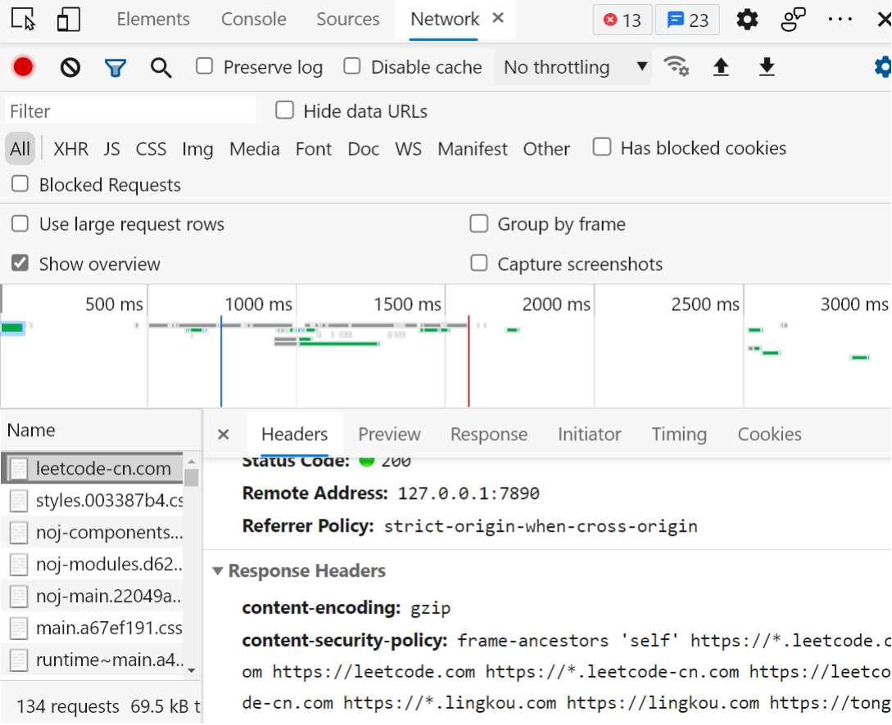

## 全链路流程概括

首先, 本文分析的是tcp/ip网络模型, 并且客户端(浏览器)与服务端的请求使用http协议。从输入url后,根据ip协议,首先便是浏览器通过DNS域名系统将域名解析成ip地址, 当有了对应的ip主机后便根据传输层tcp协议与其进行基本的tcp”三次握手”连接确保传输对方能够互通并且可互相传输数据;之后便可以根据用户发起的各种http请求进行数据回应, 返回相应的html、css、js文件, 浏览器通过解析html文件形成dom树与解析css文件形成style树,然后style树(attach)附属上dom树形成含有节点并每个节点附带位置大小等布局信息的render树 ,浏览器此时通过回流(reflow)render树读取到各个节点的布局信息, 便根据布局信息将节点渲染到相应位置, 最后通过重绘(repaint)将节点的颜色、字体等渲染出来,浏览器基本的渲染完成后变通过js文件监听节点与浏览器操作等提供相应的事件与下一步的服务请求,这样一个能够提供媒体信息与服务的网页便呈现的用户面前。

## DNS解析缓存与CDN全局负载缓存加速

DNS是域名系统,是一张域名与ip对应关系的表,当dns域名系统获得url域名后便通过此系统找到对应的ip地址。其中可通过浏览器自身缓存dns,本地也可以缓存dns后生成host文件(host文件就是域名和ip的映射关系表)。通过缓存优化后dns解析的流程大致可变为: 首先输入url后先从浏览器查取ip缓存,若没有找到则从本机host文件中查找ip缓存,再没有找到ip则查找dns服务器请求获取ip。这样通过缓存dns解析的ip就能够省去请求ip查获服务器的时间,优化请求。

随着互联网的发展,ip地址的不断增多,网络分区愈加复杂,对于大型的网络服务往往需要众多服务器支撑,通过多个服务器去承担不同地区用户的请求量,减轻服务器的承担,提高请求质量

这就需要用到CDN（Content Delivery Network，内容分发网络）技术,CDN是构建在现有互联网基础之上的一层智能虚拟网络，通过在网络各处部署节点服务器，实现将源站内容分发至所有CDN节点，使用户可以就近获得所需的内容。CDN服务缩短了用户查看内容的访问延迟，提高了用户访问网站的响应速度与网站的可用性，解决了网络带宽小、用户访问量大、网点分布不均等问题。

当请求的网络使用CDN服务时,本地DNS服务器通过CNAME的方式将最终的域名请求重新定向的CDN服务,然后根据全局负载情况,进行合理调度后分发出能使用户获得最佳请求体验的ip节点,供给用户进行http请求。

其中,CDN也使用到了缓存加速场景,当没有缓存cdn时,第一次请求cdn服务获取到最佳ip节点请求资源时,资源会缓存到当前ip节点,当下次请求时,本地dns服务会直接指向记录的cdn服务请求得到最佳ip后拉取缓存资源返回给用户

## Tcp滑动窗口

当我们通过dns服务器或cdn服务器解析域名获得ip地址后,便到了熟悉的tcp三次握手建立连接,而tcp发送一个数据后都要等待确认后再传输下一个数据包,这样的传输效率很低的

而tcp利用滑动窗口技术优化数据包往返时间与网络吞吐量。滑动窗口的大小为无需等待确认应答,而可以继续发送数据的最大值。TCP滑动窗口分为接受窗口，发送窗口,接收方通过通告发送方自己的窗口大小，从而控制发送方的发送速度，从而达到防止发送方发送速度过快而导致自己被淹没的目的。

对于TCP会话的发送方，任何时候在其发送缓存内的数据都可以分为4类，“已经发送并得到对端ACK的”，“已经发送但还未收到对端ACK的”，“未发送但对端允许发送的”，“未发送且对端不允许发送”。“已经发送但还未收到对端ACK的”和“未发送但对端允许发送的”这两部分数据称之为发送窗口。

使用滑动窗口则能够确保数据的可靠性同时保持可发送数据最大量,使网络数据能够高质量传输

## http协议升级

### http 0.9/1.0

0.9和1.0这两个版本，就是最传统的 request–response的模式。

HTTP 0.9版本的协议在请求时，不含请求头，只支持GET方法。

HTTP 1.0 扩展了0.9版,开始含有请求头,增加http状态码与content-type支持传输	不同文件

### http 1.1

开始优化网络性能问题,通过keep-alive字段让http请求能够重用tcp连接,这样就不用每次请求到要进行三次握手与四次挥手的开销。

### http 2

http2协议则通过一系列改变极大地优化网络性能

1. 使用二进制协议增加数据传输的效率;
2. 允许在一个tcp连接中并发多个请求;
3. 使用HPACK算法压缩头部消除多个请求重复的头部极大提高传输效率;
4. 允许服务端提前推送数据,当没有请求时也可将数据推送到本地缓存
   

这4条改动使http1.1有了质的飞跃

### http 3

http 2 也有缺陷: 当若干个http请求在复用同一个tcp连接时,底层的tcp协议是不知道上层有多少个http的请求,一旦发生丢包便要等待重传才能继续所有的http请求,即使其他http与等待的http无关

最新的http 3则将http底层的tcp协议改成了udp协议解决这个问题
Google 提出协议标准 – QUIC （Quick UDP Internet Connections）,udp不管顺序,不管丢包,QUIC提供新的丢包重传机制

## http缓存

当建立好tcp连接,服务端利用http协议向服务器发出请求时,利用http缓存技术能够有效优化性能,此处分为强缓存与协商缓存两种。

### 强缓存

在强缓存的情况下，浏览器不会向服务器发送请求，而是直接从本地缓存中读取内容,在上一次请求中,资源缓存到本地的同时在相应头添加有expires声明缓存过期时间cache-control缓存存在时间两者设置的时间段范围内,则缓存资源未过期,下次请求可不请求到服务器直接返回本地缓存资源,减轻服务器负担

### 协商缓存

当强缓存过期时,请求到达服务器后,会与服务器协商进行是否更新请求资源。协商缓存是利用的是【Last-Modified，If-Modified-Since】和【ETag、If-None-Match】这两对Header来管理的。

Last-Modified表示本地文件最后修改日期，浏览器会在request header加上If-Modified-Since（上次返回的Last-Modified的值），询问服务器在该日期后资源是否有更新，有更新的话就会将新的资源发送回来;

Etag则资源变化都会导致ETag变化，跟最后修改时间没有关系，ETag可以保证每一个资源是唯一的,If-None-Match的header会将上次返回的Etag发送给服务器，询问该资源的Etag是否有更新，有变动就会发送新的资源回来

当代表缓存时间(Last-Modified)与空间(Etag)的标志与上一次请求都没有发生改变时,则直接返回304状态码,并且浏览器读取本地缓存

当其中之一发生了变化,则返回200,并成功在请求中返回新的资源到客户端浏览器与客户端浏览器本地缓存

## Gzip压缩

现今,当请求获取html、css、js、xml文件,服务器返回这些资源文件的时候,有一种新的Gzip压缩文件网络性能优化方案,能够大幅度提高页面加载速度。响应头返回content-encoding: 
gzip字段表示该响应数据利用gzip压缩返回。

其利用了服务器Nginx工具或前端框架构建工具(wepack、vite)在响应数据时就会将资源文件代码压缩,大大提高传输效率。

